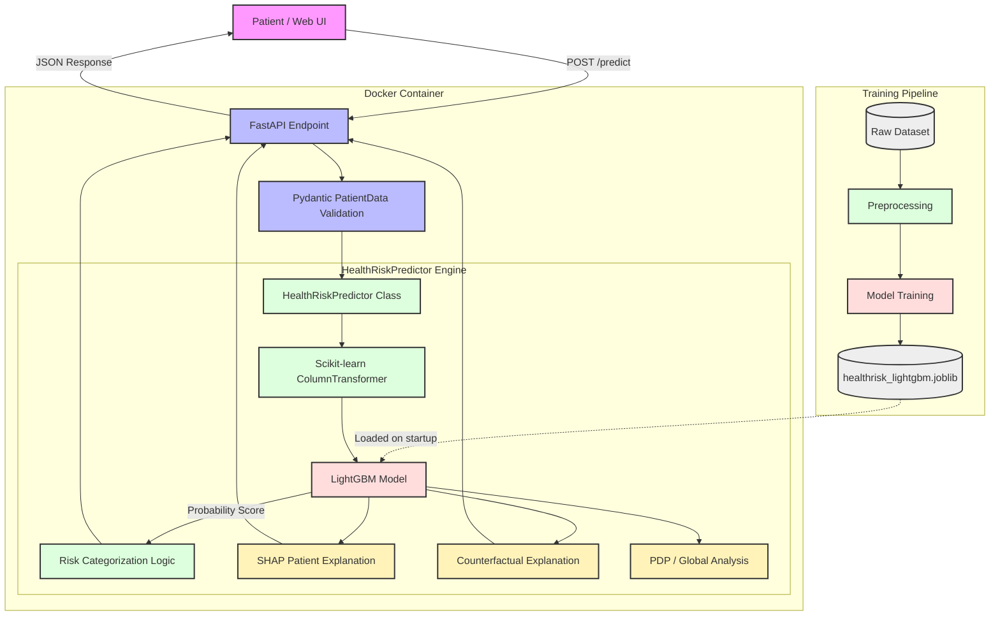

# HealthRisk AI Architecture

This document describes the high-level architecture and data flow for the HealthRisk AI platform.

## System Architecture

## Data Flow Explanation

1. **Offline Training Phase**: The raw dataset undergoes preprocessing to handle missing values, scale numerical features, and one-hot encode categorical features. The LightGBM binary classifier is trained on this processed data and the final pipeline (preprocessor + model) is saved to disk as a `.joblib` artifact.
2. **System Initialization**: When the Docker container starts, the FastAPI application boots up and loads the saved LightGBM model into memory via the `HealthRiskPredictor` class.
3. **Inference Request**: A user submits patient data via the Web UI to the `/predict` API endpoint.
4. **Validation**: FastAPI uses Pydantic (`PatientData` schema) to ensure the incoming payload contains all the necessary features with the correct data types.
5. **Prediction**: The validated payload is passed to the `HealthRiskPredictor`, which runs it through the exact same `ColumnTransformer` preprocessing steps used during training, and then queries the LightGBM model.
6. **Risk Categorization**: The raw probability score from LightGBM is mapped to a discrete Risk Category (Low, Moderate, High) via internal threshold logic.
7. **Explainability**:
   - **SHAP**: Generates local feature importance, detailing exactly which factors increased or decreased this specific patient's risk.
   - **Counterfactuals**: Hypothesizes minimal changes (e.g., reducing length of stay) to lower the patient's risk category.
   - **PDP**: (Global analysis) Provides macroscopic views of how specific features impact the model overall.
8. **Response**: The consolidated prediction, category, and SHAP explanations are returned to the client.
